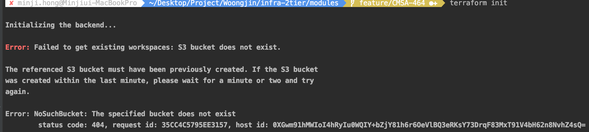

## Infra-2tier Directory
---
infra-2tier의 디렉토리 구조입니다.

---

### 1. tf-repository
>`S3` 저장소와 Lock 관리를 위한 `DynamoDB`가 구현되어 있습니다.  
>**modules 보다 먼저 구현**되어야 합니다.  
>(S3, DynamoDB가 먼저 구현되어야, modules에서 사용할 수 있기 때문입니다.)
>

>
#### 1.1 tf-repository 인프라 구축 방법  
```console
cmd $ cd ~
cmd $ mkdir workspace
cmd $ cd workspace

/* git clone */
cmd $ git clone https://github.com/pe-woongjin/infra-2tier.git
cmd $ cd ~/workspace/infra-2tier/tf-repository

/* terraform */
cmd $ terraform init
cmd $ terraform plan
cmd $ terraform apply
```


### 2. modules
>infra-2tier의 베이스 모듈인 `elb`, `iam`, `vpc` 구성되어 있습니다.
> 
#### 2.1 modules 인프라 구축 방법  
```console
 cmd $ cd ~
 cmd $ mkdir workspace
 cmd $ cd workspace
 
 /* git clone */
 cmd $ git clone https://github.com/pe-woongjin/infra-2tier.git
 cmd $ cd ~/workspace/infra-2tier/modules
 
 /* terraform */
 cmd $ terraform init
 cmd $ terraform plan
 cmd $ terraform apply
```
>
### 3. site
#### 3.1 docs
>infra-2tier `명세 및 아키텍쳐`와 관련된 문서가 포함되어 있습니다.  
#### 3.2 mkdocs
>`매뉴얼 가이드` 폴더입니다.    
>mkdocs 마크다운 방식으로 글쓰기를 하며, `mkdocs serve`라는 명령어를 통해서 실시간으로 매뉴얼 내역을 확인할 수 있습니다. ([mkdocs.org](https://www.mkdocs.org) 참고)  