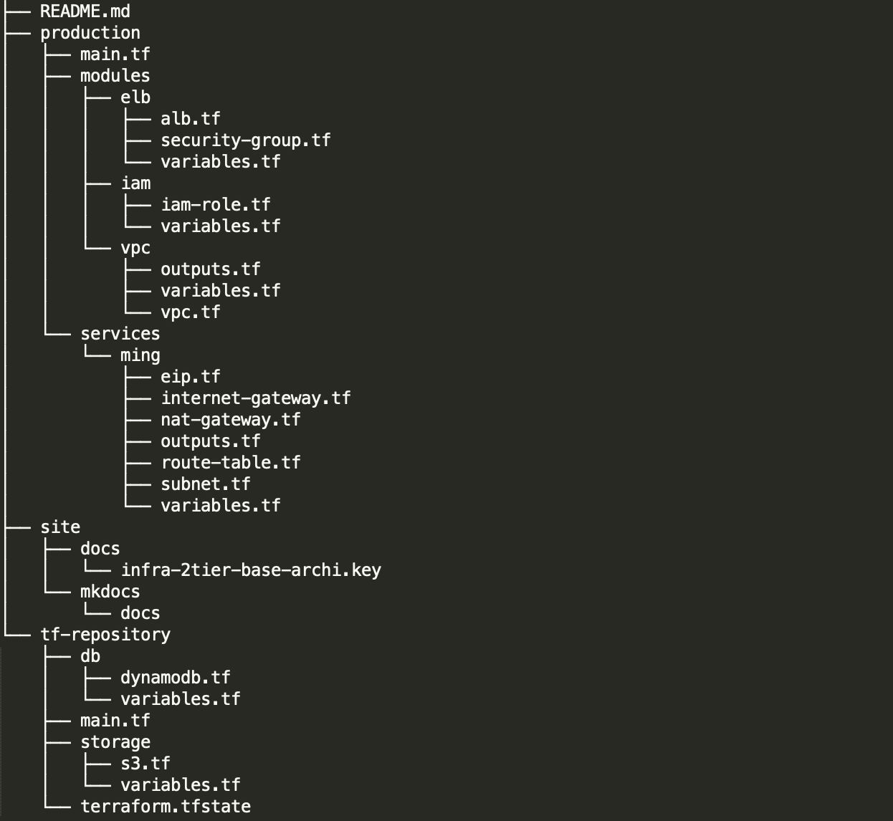

## infra-2tier-base Directory
---
infra-2tier의 디렉토리 구조입니다.

---

### 1. production
>인프라 환경(development, stage, production)을 의미합니다.
#### 1.1 modules
>다른 인프라의 참조가 되는 기본 리소스인 `elb`, `iam`, `vpc`로 구성되어 있습니다.
#### 1.2 services
>`vpc`를 참조하는 eip, internet-gateway, nat, route-table, subnet 등으로 구성되어 있습니다.
>
### 2. tf-repository
>`S3` 저장소와 Lock 관리를 위한 `DynamoDB`가 구현되어 있습니다.  
>**production 보다 먼저 구현**되어야 합니다.  
>(S3, DynamoDB가 먼저 구현되어야, production 환경에서 사용할 수 있기 때문입니다.)
>
### 3. site
#### 3.1 docs
>infra-2tier-base`명세 및 아키텍쳐`와 관련된 문서가 포함되어 있습니다.  
#### 3.2 mkdocs
>`매뉴얼 가이드` 폴더입니다.    
>mkdocs 마크다운 방식으로 글쓰기를 하며, `mkdocs serve`라는 명령어를 통해서 실시간으로 매뉴얼 내역을 확인할 수 있습니다. ([mkdocs.org](https://www.mkdocs.org) 참고)  