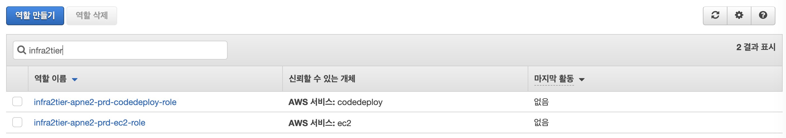

## Infra-2tier iam
---
각 `IAM Role`이 구현되어 있습니다.

---
#### 1. 구성

##### 1.1 EC2
>EC2에서 사용하는 `role`을 정의합니다.
>
##### 1.2 Code-Deploy  
>Code-Deploy에서 사용하는 `role`을 정의합니다.
>
#### 2. 인프라 구축 방법  
```console
cmd $ cd ~
cmd $ mkdir workspace
cmd $ cd workspace

/* git clone */
cmd $ git clone https://github.com/pe-woongjin/infra-2tier.git
cmd $ cd ~/workspace/infra-2tier/modules/iam

/* terraform */
cmd $ terraform init
cmd $ terraform plan
cmd $ terraform apply
```