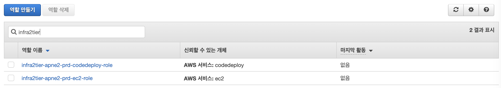
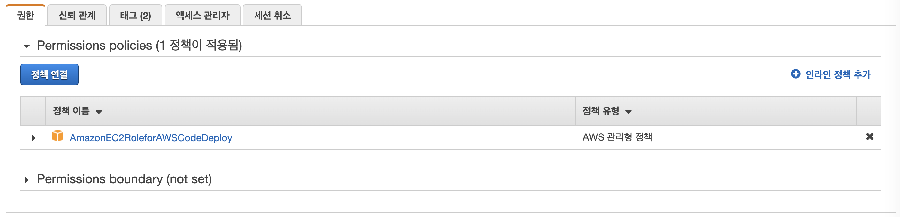
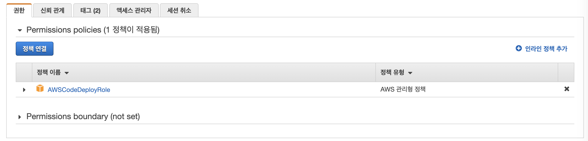

## infra-2tier-basemodules
---
modules는 `vpc`, `elb`, `iam`로 구성되어 있습니다.

---
#### 1. VPC
`vpc`와 관련 리소스 `eip`, `internet-gateway`, `nat-gateway`, `route-table`, `subnet` 등으로 구현되어 있습니다.
```console
resource "aws_vpc" "vpc" {                          -- VPC 설정
    cidr_block            = var.vpc_cidr_block      -- CIDR Block
    ...
}

resource "aws_internet_gateway" "igw" {             -- Internet gateway 설정
    vpc_id = aws_vpc.vpc.id                         -- 구축한 VPC id
    ...
}

resource "aws_eip" "eip" {                          -- Elastic ip 설정
    vpc         = true                              -- VPC
    deponds_on  = [ aws_internet_gateway.igw ]      -- Internet gateway 참조
    ...
}

resource "aws_nat_gateway" "nat" {                              -- NAT 설정
    allocation_id   = aws_eip.eip.id                            -- eip
    depends_on      = [ aws_internet_gateway.igw, aws_eip.eip ] -- Internet gateway, eip 참조
    ...
}
```  
>
#### 2. ELB
`Application Load Balancer`의 기본 틀이 구현되어 있습니다.
```console
resource "aws_alb" "alb" {                                  -- ALB 설정
    load_balancer_type  = "application"                     -- ALB 타입
    subnets             = var.pub_sn_ids                    -- subnet
    security_groups     = [ aws_security_group.alb-sg.id ]  -- security group
    ...
}
```
>
#### 3. IAM

##### 3.1 EC2
EC2에서 사용하는 `role`을 정의합니다.
```console
resource "aws_iam_role" "codedeploy-ec2-role" {
    name = "codedeploy-ec2-role"
    ...
}
```

>
##### 3.2 Code-Deploy  
Code-Deploy에서 사용하는 `role`을 정의합니다.
```console
resource "aws_iam_role" "codedeploy-role" {
    name = "codedeploy-role"
    ...
}
```
